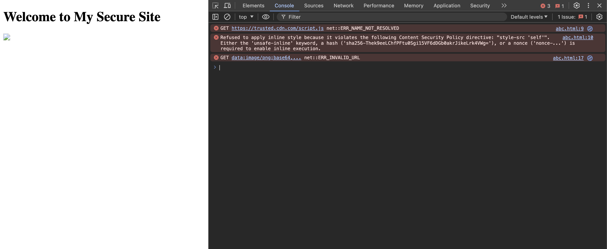

+++
categories = "html"
disableToc = true
title = "Content Security Policy in Web Browsers"
weight = 20

+++


Content Security Policy (CSP) is a security feature that helps prevent a range of attacks, including Cross-Site Scripting (XSS) and data injection attacks. It does this by allowing website administrators to control the resources that a browser is allowed to load for a given page. By specifying a CSP, administrators can reduce the risk of malicious content being executed by the browser.

Here are the key components and concepts of CSP:

1. **Policy Definition**: The CSP is defined using the `Content-Security-Policy` HTTP header or a `<meta>` tag in the HTML document. The policy consists of one or more directives that specify the allowed sources for different types of content.

2. **Directives**: Each directive controls a specific type of resource or behavior. Common directives include:
    - `default-src`: Serves as a fallback for other resource types when no other directives are defined.
    - `script-src`: Specifies valid sources for JavaScript.
    - `style-src`: Specifies valid sources for stylesheets.
    - `img-src`: Specifies valid sources for images.
    - `connect-src`: Specifies valid sources for network requests (e.g., AJAX, WebSockets).
    - `font-src`: Specifies valid sources for fonts.
    - `object-src`: Specifies valid sources for plugins like Flash.
    - `media-src`: Specifies valid sources for media files (e.g., audio, video).
    - `frame-ancestors`: Locations from which this web page can be loaded using a frame, iframe, object, embed, or applet element.Basically, this directive allows you to specify what parent source may embed a page.
    - `frame-src`: Specifies valid sources for nested browsing contexts (e.g., iframes).i.e. allows you to specify where iframes in a page may be loaded from. Note: frame-ancestors allows you to specify what parent source may embed a page. This differs from frame-src, which allows you to specify where iframes in a page may be loaded from.
    - `form-action`: URLs that can be used as part of an action in a <form> tag, meaning the browser restricts where form results can be sent. The form action does not revert to default-src, so this is a mandatory property if you are using form elements on your site.
    - `plugin-types`: the set of plugins that can be invoked via objects, embeds, or applets, defined using MIME types.
    - `base-uri`: Allows URLs in the src attribute of any tag.


3. **Source Values**: Each directive can have multiple source values that determine where the content can be loaded from. Source values include:
    - `'self'`: Allows content from the same origin as the page.
    - `'none'`: Disallows all content of the specified type.
    - `'unsafe-inline'`: Allows inline resources like `<style>` and `<script>`. Use with caution as it weakens the policy.
    - `'unsafe-eval'`: Allows the use of `eval()` and similar methods. Use with caution as it weakens the policy.
    - Specific URLs or URL patterns: Allows content from specified domains or subdomains.

4. **Example CSP Header**:
   ```http
   Content-Security-Policy: default-src 'self'; script-src 'self' https://trusted.cdn.com; style-src 'self' 'unsafe-inline'; img-src 'self' data:;
   ```
This policy allows scripts from the same origin and a trusted CDN, inline styles, images from the same origin, and data URIs.

5. **Report-Only Mode**: CSP can be deployed in a `report-only` mode to test the policy without enforcing it. This mode uses the `Content-Security-Policy-Report-Only` header. Violations are reported but not blocked.

6. **Violation Reporting**: CSP can be configured to report policy violations to a specified URI using the `report-uri` or `report-to` directive. This helps in monitoring and fine-tuning the policy.

### Benefits of CSP

- **Mitigates XSS Attacks**: By restricting the sources from which scripts can be loaded, CSP significantly reduces the risk of XSS attacks.
- **Prevents Data Injection**: CSP helps prevent attackers from injecting malicious content into web pages.
- **Improves Security Posture**: CSP provides a robust mechanism to enforce security policies and monitor violations.

### Example Usage

Here's an example of how to implement CSP in a web application using the `Content-Security-Policy` header:

```html
<!DOCTYPE html>
<html>
<head>
    <meta http-equiv="Content-Security-Policy" content="default-src 'self'; script-src 'self' https://trusted.cdn.com; style-src 'self' 'unsafe-inline'; img-src 'self' data:;">
    <title>My Secure Site</title>
</head>
<body>
    <h1>Welcome to My Secure Site</h1>
    <script src="https://trusted.cdn.com/script.js"></script>
    <style>
        body { font-family: Arial, sans-serif; }
    </style>
    
</body>
</html>
```

In this example, the CSP allows scripts from the same origin and a trusted CDN, allows inline styles, and allows images from the same origin and data URIs. This policy helps secure the web application against various types of attacks.


### Testing CSP Without 'unsafe-inline'
To test the CSP by removing the 'unsafe-inline' from the style-src directive, we can use the following example:

```html
<!DOCTYPE html>
<html>
<head>
    <meta http-equiv="Content-Security-Policy" content="default-src 'self'; script-src 'self' https://trusted.cdn.com; style-src 'self'; img-src 'self' data:;">
    <title>My Secure Site</title>
</head>
<body>
    <h1>Welcome to My Secure Site</h1>
    <script src="https://trusted.cdn.com/script.js"></script>
    <style>
        body { font-family: Arial, sans-serif; }
    </style>
    
</body>
</html>
```

In this example, the CSP does not include 'unsafe-inline' in the style-src directive. As a result, the inline styles should not be applied, and the font styling for the body should not be loaded.

### Result of CSP Test

The following screenshot demonstrates the effect of removing `'unsafe-inline'` from the `style-src` directive. As expected, the inline styles are not applied.

**Preview** `csp-error.png`:

